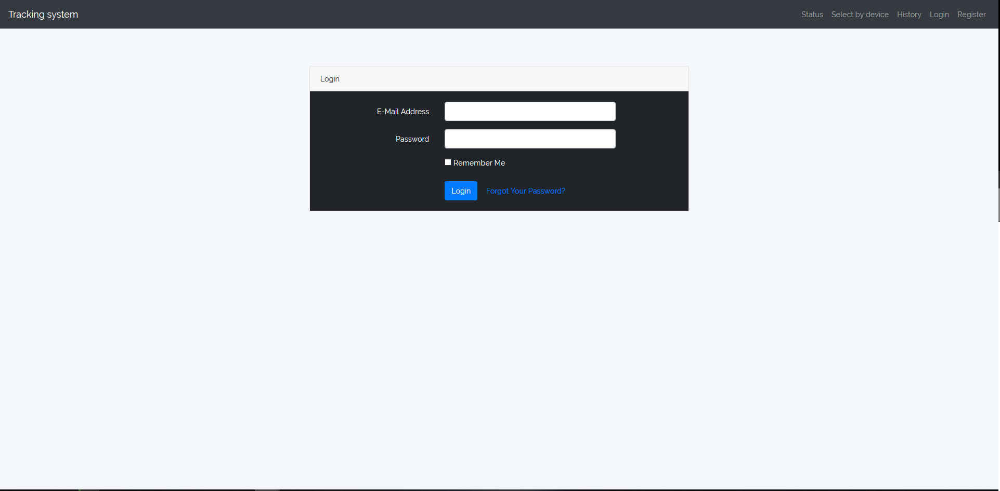
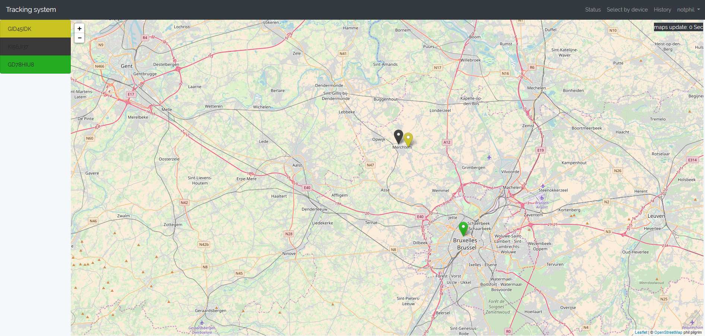
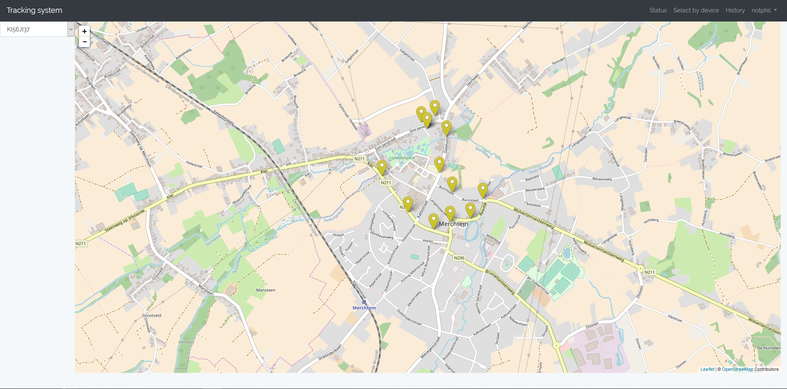

# final work project

This is a map application that I built using AngularJS, Leaflet.js and Laravel Framework.

## Setup the project locally

1) Install composer on your system. Download composer and install it on your system. https://getcomposer.org/download/

2) Clone this project code on your system.
    ```bash
    $ git clone https://github.com/KezeirP/eindwerk.git
    ```
3) Run composer install
    ```bash
    $ composer install
    ```

4) Run the project on your localhost.

    $ php artisan serve

## View the project on the server


## User guide
### Login
The first thing you'll see when you go to website is the login screen. \

You'll probably won't have an account, so let's make one! \
Click the button in the right top corner. \
 The process is quite simple so it should be a big problem \
Login once you made the account. 

### Adding codes
You'll see an empty map. You didn't add any devices yet so it's normal.
So next up I'll explain how to add devices to your application.
1) click on your username and click on add code in the dropdown.
2) Add your device.

    I have added a list of devices to the page.
    I would recommend adding device:
    ```
    KI56JI37
    ```
    This is an actual device I created and drove around with.

3) go to the status page and check where this device is at the moment.



4) You can also go to the select by device page and search for your device. This will give you the route the device has driven.


